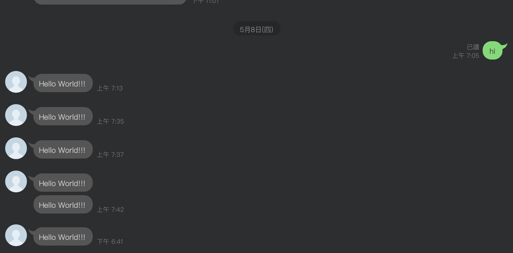
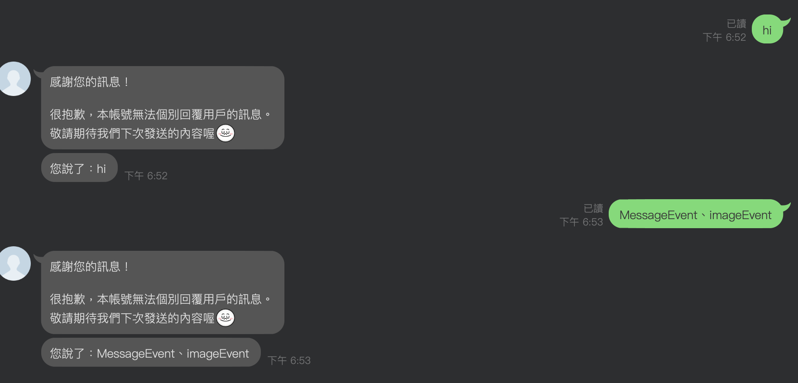
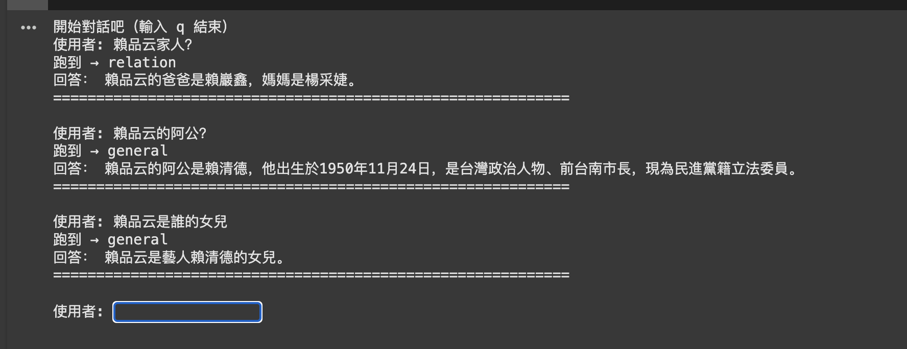

# 女鵝專用 Line 聊天機器人
在2024年4月28日，我終於當上爸爸了！！！
我可愛的小女鵝，她是金牛座的寶貝。為了紀念這個特別的時刻，我計畫為她創建一個專屬的 LINE 帳號，並與家人和朋友一起分享這份喜悅和愛。

## 期望功能
- 推播&回覆
- 透過 ngrok，將本地 API 轉為為公共 URL，實現對外公開訪問
- 家人關係(LangGraph)
- 照片上傳＆儲存
- 未完待續...

## 測試完成
- 推播
 
 
- 回覆
 

## TODO
- 模型回覆不正確：寶貝女鵝～你爸爸＆阿公不是賴清德ＱＱ

- LangGraph 繪圖失敗
